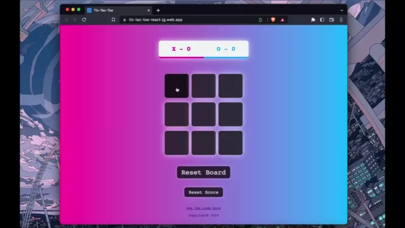

# Basic Tic-Tac-Toe game!

Wanted to make a simple game, so what better than Tic-Tac-Toe!

It is completely functional, but I would love to add some kind of option to play against an AI opponent when you don't have 2 human players!

Followed a [tutorial](https://www.youtube.com/watch?v=c8dXnuVwmA8) to get the basic layout, but made many improvements for functionality.

Updates: The game would not reset to the "X" player when a round ended, that has been fixed. Fixed game so resetting the board works properly, even when there is no winner for the round. Added a reset scoreboard function, which also resets the game board. All styling was customized.

[Play a game for yourself!](https://tic-tac-toe-react-jg.web.app)
